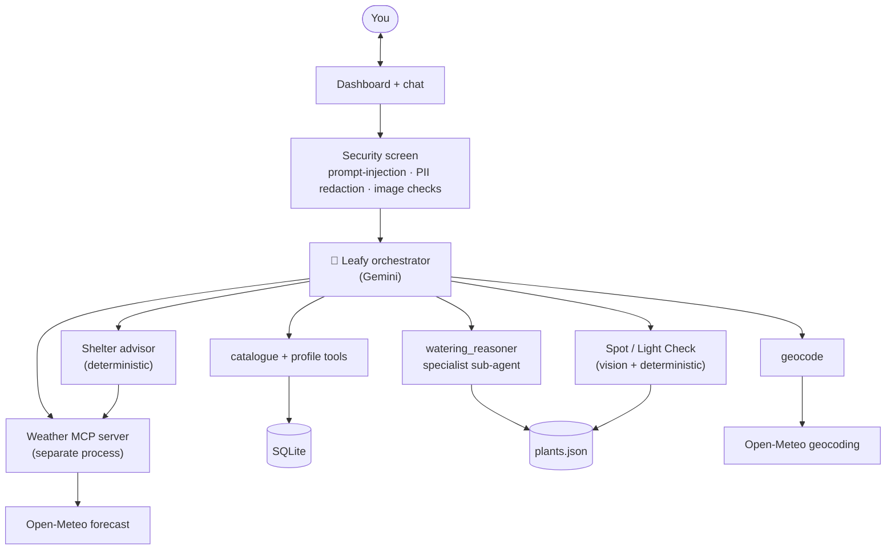

# 🌿 Leafy — a personal plant-care concierge

Leafy is an AI concierge for your houseplants. Tell it where you live and what you own once, and from then on it tells you when to water, when to move a plant out of bad weather, and what will actually thrive in a given spot — tuned to your local climate and each plant's real needs.

Track: Concierge Agents
Built for the Kaggle × Google 5-Day AI Agents Intensive Capstone.

---

## The story

Houseplants are everywhere. Surveys put ownership at roughly two in three households, and for a lot of people it is the small daily ritual that makes a home feel calmer and more alive.

Most of those plants quietly die. Industry surveys attribute the majority of home plant deaths to two mundane causes: overwatering, and the wrong amount of light. The advice people follow tends to make it worse. "Water once a week, give it bright light" ignores the two things that actually decide a plant's fate, which are your local climate and where you place it. In a cloudy, rainy city a fixed weekly schedule drowns a succulent, and a "bright" north-facing windowsill barely keeps basil going.

Getting it right is harder than it sounds, because it is not a lookup. A good call depends on several live, changing things at once: the plant's baseline needs, today's temperature and rainfall, whether it sits indoors or outdoors, and how long since it was last watered. And the apps that exist are reactive. You snap a photo and get told the plant is already sick, which is a diagnosis after the damage is done, and single-photo diagnosis is unreliable anyway.

So the question is simple. What if you had someone who already knew your plants, your home, and today's weather, and told you what to do before anything went wrong?

That is what Leafy is. It is a concierge, not a diagnosis tool. You give it your location and your plants once, and after that it holds that context and does the reasoning for you. A dashboard surfaces what needs attention today, and in chat you can ask about watering, sheltering from the weather, or what suits a new spot, in any order. Leafy gathers what it needs, reasons over live weather and each plant's profile, and explains itself.

The payoff is that the help is preventive instead of reactive, and personal instead of generic. Every recommendation comes with a way to check it yourself, for example "push a finger three centimetres into the soil and only water if it is dry," so Leafy guides and you stay in control. It never claims a certainty it does not have.

## Why an agent, and not a chatbot or a database

A database could store your plants, and a classifier could name one from a photo. Neither can look at your specific plant, in your climate, on today's date, and decide what to do. That takes an agent: something that gathers the right information, some from you and some from live weather, reasons across it, and explains the call. Leafy earns the label by coordinating specialist tools and a sub-agent under one orchestrator that decides, turn by turn, what the situation needs. The decisions that have to be trustworthy are computed in deterministic code rather than left to the model, which is what keeps a conversational assistant from drifting into a confident guess.

## What it does today

Three capabilities are built end to end and share the same foundations of location, plant catalogue, and live weather.

| Capability | Status | What it does |
|---|---|---|
| Watering Advisor | Built | Recommends when to water next from live weather, the plant's needs, the last-watered date, and indoor or outdoor placement, with a plant-specific way to check the soil yourself. |
| Shelter Advisor | Built | Reads today's forecast and, per plant, recommends keeping it put, bringing it in, or moving it out, with the reason. |
| Light / Spot Check | Built | From a photo of a spot plus the compass direction it faces, estimates the light it gets and which plants would suit it. |
| Soil Matcher | Roadmap | Recommends a soil or mix for a plant from the soils you already own. |

## How it works

Leafy is orchestrated by an LLM. One orchestrator on Gemini holds a toolbox and decides, from what you actually ask, which tools to call and when to ask for more. For the parts that must be correct and consistent, such as a watering window, a move-indoors call, or a light rating, it hands off to deterministic code or a grounded specialist, so the model phrases the answer but does not invent it. Perceive with the model, decide with code is the throughline of the whole design.

When you ask for watering advice, Leafy makes sure it has your location, the plant, and the last-watered date and placement, asking for whatever is missing. It pulls live conditions from the weather server and delegates the final call to the watering specialist, which returns a structured recommendation grounded in the plant's profile.

## Design decisions

A conversational assistant benefits from the model choosing the path, so Leafy uses LLM orchestration rather than a wired state machine, which would feel like a scripted chatbot that cannot change topic. Where a capability genuinely needs guaranteed steps, it drops into a small deterministic sub-flow, which is why the Shelter advisor is computed rather than reasoned.

The watering specialist is invoked as a tool and returns its result, so the orchestrator stays in control of the conversation instead of handing it away. Weather is exposed as a standalone server over the Model Context Protocol, so it is reusable and language-agnostic rather than a private in-process function. The plant catalogue and profile live in SQLite as the single source of truth, and care details are resolved from a plant's identity at the point of use rather than copied onto records, so nothing goes stale. Security runs as a callback before the model ever sees a turn.

## Course concepts demonstrated

| Concept | Where it lives |
|---|---|
| Multi-agent system (ADK) | Leafy orchestrator plus the watering specialist sub-agent, with meaningful tool use |
| MCP server | `mcp_servers/weather_server.py`, a FastMCP weather server connected over MCP |
| Security and guardrails | `app/security/`, prompt-injection defence, PII redaction, and image validation as a before-model callback |
| Evaluation | Trajectory tests plus deterministic invariants and LLM-as-judge scoring over execution traces |
| Agent skills (agents-cli) | Built with the agents-cli toolchain and its local eval |

## Tech stack

Google ADK, Gemini 2.5 Flash, the agents-cli toolchain, MCP via FastMCP, Open-Meteo for keyless geocoding and weather, SQLite, Pydantic, FastAPI for the app and UI, and pytest. Built with agentic coding tools including Antigravity.

## Run it and test it

Everything runs locally on a single free API key. See [SETUP.md](SETUP.md) for the few-minute setup, the prompts that exercise all three capabilities, and the test commands. Sample photos and prompts for judges to try are in [test-assets/](test-assets/).

## How it is tested

Leafy is tested at three levels. Deterministic unit tests cover each tool in isolation, including the security screen. Integration tests lock in the behaviour of each user journey, asserting which tools run, in what order, and with what preconditions, so a fix in one place cannot silently break another. On top of that, an LLM-as-judge evaluation scores full execution traces. Because the model now chooses the path, the tests check the steps taken, not only the final answer.

## Responsible AI

Leafy is built to guide, not to guarantee. Every recommendation is paired with a way to verify it by hand, and it flags when its guidance is generic, for example for a plant that is not in the knowledge base. It does not fabricate data. If it cannot resolve a location or find a plant, it says so rather than guessing. It also stays in character and does not expose its internals.

## Limitations and roadmap

The current build is single-user with a local profile, and multi-user accounts are future work. Identifying a plant from a photo, with a confirmation step, is designed as an enhancement to the add-a-plant flow. The Soil Matcher is designed and shares the same foundations. Deployment to a managed runtime, with a proactive daily trigger, is on the roadmap. The security screen checks each incoming turn but does not yet scrub already-stored conversation history.

---

Plant care data here is curated guidance, not a guarantee. Always check your plant and soil before watering.
